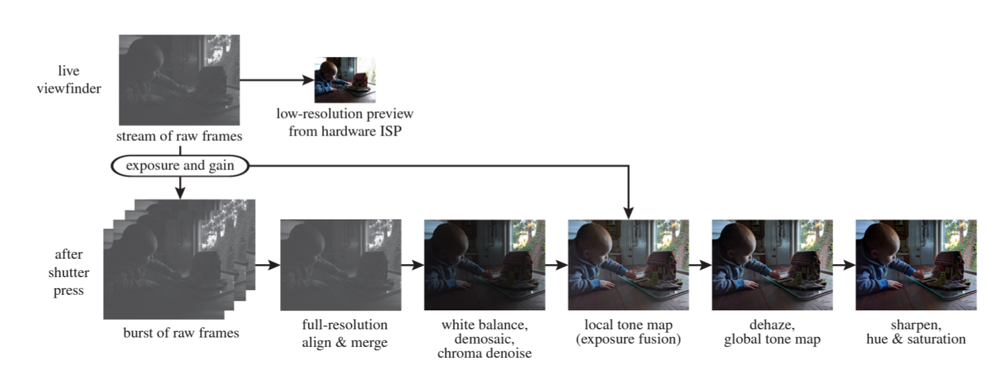

## HDR+ Denoising Pipeline

Summary: Taking multi-shot / burst sequences of images as input, we aim to implement a burst denoising pipeline (based on Google's HDR+) to produce a temporally and spatially denoised image, which in turn become suitable for HDR image generation. 

### Team members
Haohua Lyu ([haohua@berkeley.edu](mailto:haohua@berkeley.edu))

Xiao Song ([xiaosx@berkeley.edu](mailto:xiaosx@berkeley.edu))

Cyrus Vachha ([cvachha@berkeley.edu](mailto:cvachha@berkeley.edu))

Siming Liu ([liusm220036@berkeley.edu](mailto:liusm220036@berkeley.edu))

---

## Milestone Report

View as separate PDF file: [HDR Milestone Report](CS_184_284A_Final_Project_Milestone_HDR.pdf)

<iframe src="CS_184_284A_Final_Project_Milestone_HDR.pdf" width="100%"></iframe>

---

## Video

---

## Slides